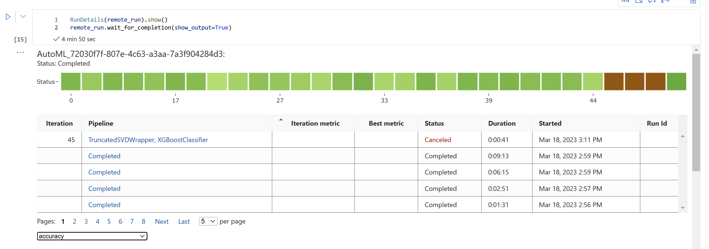

# Capstone Project: Azure Machine Learning Engineer

This project is composed of two sections: the first will incorporate Automated ML (AutoML) and the second will be a personalized model whose hyperparameters are adjusted through HyperDrive. The model trained by AutoML will be put into action and can be accessed as a Machine Learning service with which we can communicate through a REST API. We will use a kaggle data set to educate the model to categorize the `passenger survival probability` based on passenger data (ie name, age, gender, socio-economic class, etc). and we will make use of all the different tools presented in AzureML Studio for this purpose. Please look at the following section for more details regarding the data set utilized in this project.

## Dataset

### Overview
The dataset we will be using in this project is called *Titanic - Machine Learning from Disaster* and is publicly available from Kaggle. 

Using this dataset we aim to build a predictive model that answers the question: “what sorts of people were more likely to survive?” using passenger data (ie name, age, gender, socio-economic class, etc).

Here is a [link](https://www.kaggle.com/competitions/titanic/data) to the data.  

### Task
The task we are concerned with is to use machine learning to create a model that predicts which passengers survived the Titanic shipwreck. We will be using `Survived` column as the target and since this is a boolean variable, the task at hand is Binary Classification.

The 12 input features and the target feature are as follows:
- PassengerId
- Survived
- Pclass
- Name
- Sex
- Age
- SibSp
- Parch
- Ticket
- Fare
- Cabin
- Embarked

### Access
In the cell below, we will write code to retrieve the data that we have stored on Azure:
```
from azureml.core import Dataset
# Try to load the dataset from the Workspace. Otherwise, create it from the file
# NOTE: update the key to match the dataset name
found = False
key = "Titanic Dataset"
description_text = "Titanic DataSet for Capstone Project"

if key in ws.datasets.keys(): 
        found = True
        dataset = ws.datasets[key] 

if not found:
        # Create AML Dataset and register it into Workspace
        example_data = 'https://raw.githubusercontent.com/ratheswaran/directory_name/main/train.csv'
        dataset = Dataset.Tabular.from_delimited_files(example_data)        
        #Register Dataset in Workspace
        dataset = dataset.register(workspace=ws,
                                   name=key,
                                   description=description_text)
```

## Automated ML
In this section of the assignment, Microsoft Azure Cloud is utilized to create a cloud-based machine learning model and deploy it. We initially set up a compute target with the following specifications: `vm_size="Standard_D2_V2"`, `min_nodes=0`, `max_nodes=4` and then train a collection of machine learning models with AutoML to automatically train and adjust them according to the pre-defined target metric, which in this case is `Accuracy` and it is registered through the command:

```
amlcompute_cluster_name = "aml-compute"

# Verify that cluster does not exist already
try:
    compute_target = ComputeTarget(workspace=ws, name=amlcompute_cluster_name)
    print('Found existing cluster, use it.')
except ComputeTargetException:
    compute_config = AmlCompute.provisioning_configuration(vm_size='STANDARD_D2_V2',# for GPU, use "STANDARD_NC6"
                                                           #vm_priority = 'lowpriority', # optional
                                                           max_nodes=4)
    compute_target = ComputeTarget.create(ws, amlcompute_cluster_name, compute_config)

compute_target.wait_for_completion(show_output=True, min_node_count = 1, timeout_in_minutes = 10)
```
### AutoML Configuration and Settings
For this binary classification task, set the argument `task` to `classification` and the `label_column_name` to `"Survived"`. To maximize efficiency, create a separate cluster for the experiment, matching the number of `max_concurrent_iterations` to the number of nodes in the cluster. Additionally, set `featurization` to `True` to enable automated feature engineering. The following are the settings used:

```
# AutoMl settings
automl_settings = {
    "experiment_timeout_minutes": 30,
    "max_concurrent_iterations": 4,
    "primary_metric": "accuracy",
    "enable_early_stopping": True,
    "verbosity": logging.INFO
}

# AutoMl config
automl_config = AutoMLConfig(compute_target=amlcompute_cluster_name,
                             task="classification",
                             training_data=dataset,
                             label_column_name="Survived",
                             n_cross_validations=5,
                             featurization="auto",
                             path=project_folder,
                             debug_log = "automl_errors.log",
                             **automl_settings                             
                            )
```
Once the AutoML experiment has concluded, the most accurate model is chosen from the models trained, and then deployed on Azure Container Instance (ACI). This allows the model to be accessed via a REST API.

### Results
The model with the highest accuracy from AutoML was the `VotingEnsemble` with a score of 0.845, as seen in the image below. The parameters of its inner estimators and their individual weights used to combine them are visible, along with the identifiers for each estimator used. For additional information, please refer to [this](automl.ipynb) notebook.


**RunDetails widget**



## Hyperparameter Tuning
This pipeline uses a custom-coded Scikit-learn logistic regression model stored in a train.py script, along with a Hyperdrive run that performs random sampling over the model parameters. The data undergoes preprocessing and is split into train and test sets. The logistic regression parameters are set to a `uniform` distribution with a minimum of 0.0001 and a maximum of 1 for the inverse of regularization strength, and a range of values (5, 25, 50, 100, 200, 500, 1000) for the `maximum number of iterations` convergence. The `BanditPolicy` class is also utilized to provide an early termination policy based on slack criteria, and a frequency and delay interval for evaluation.

### Hyperparameter Configuration and Settings
```
# Specify parameter sampler
ps = RandomParameterSampling(
    {
        "--C": uniform(0.0001, 1.0),
        "--max_iter": choice(5, 25, 50, 100, 200, 500, 1000)
    }
)

# Specify a Policy
policy = BanditPolicy(evaluation_interval=2, slack_factor=0.1)

if "training" not in os.listdir():
    os.mkdir("./training")

# Setup environment for your training run
sklearn_env = Environment.from_conda_specification(name='sklearn-env', file_path='myenv.yml')

# Create a ScriptRunConfig Object to specify the configuration details of your training job

src = ScriptRunConfig(source_directory=".",
                      script='train.py',
                      compute_target=compute_target,
                      environment=sklearn_env)

# Create a HyperDriveConfig using the src object, hyperparameter sampler, and policy.
hyperdrive_config = HyperDriveConfig(run_config=src,
                    hyperparameter_sampling=ps,
                    policy=policy,
                    primary_metric_name='Accuracy',
                    primary_metric_goal=PrimaryMetricGoal.MAXIMIZE,
                    max_total_runs=16,
                    max_concurrent_runs=4)
```


### Results
The model with the highest accuracy from Hyperdrive was the `HD_1ba84d5a-e2d8-4e69-9c49-b8596c52b7b9_10` with a score of 0.815, as seen in the image below. 

Retrieved with the following code:
```
best_run = hyperdrive_run.get_best_run_by_primary_metric()
best_run_metrics = best_run.get_metrics()
parameter_values = best_run.get_details()['runDefinition']['arguments']

print("Best Experiment Run:")
print(f" Best Run Id: {best_run.id}")
print(f" Accuracy: {best_run_metrics['Accuracy']}")
print(f" Regularization Strength: {best_run_metrics['Regularization Strength:']}")
print(f" Max iterations: {best_run_metrics['Max iterations:']}")
```

Providing the following output:
```
Best Experiment Run:
 Best Run Id: HD_1ba84d5a-e2d8-4e69-9c49-b8596c52b7b9_10
 Accuracy: 0.8156424581005587
 Regularization Strength: 0.9120482384941757
 Max iterations: 25
```

For additional information, please refer to [this](hyperparameter_tuning.ipynb) notebook.


**RunDetails widget**


## Model Deployment
We are utilizing the most accurate ML model from AutoML experiment and deploying it using Azure Container Instance (ACI). This model can be reached through a REST API. We have additionally included a file with the environment information, `myenv.yml`, in order to guarantee reproducibility. To query the endpoint, we are taking five samples from the dataset so we can decide if the model did well on the input data and returned the correct prediction. Here is a snippet of code with an example of the input we used to make a request to the model:

**Register Model**
```
model = Model.register(workspace=ws,
                       model_name="titanic_pred_model", 
                       model_path="./best_automl_model.joblib",
                       description="Best AutoML model"
                      )
```
Output
```
Registering model titanic_pred_model
```
**Deploy Model**
```
best_run.download_file(constants.CONDA_ENV_FILE_PATH, 'myenv.yml')
env = Environment.from_conda_specification(name="myenv", file_path="./myenv.yml")

#env = best_run.get_environment()

inf_config = InferenceConfig(environment=env,
                             entry_script='./score.py')

deployment_config = AciWebservice.deploy_configuration(cpu_cores=1,
                                                       memory_gb=1,
                                                       auth_enabled=False,
                                                       enable_app_insights=True)

service = Model.deploy(workspace=ws, 
                       name="automl-service",
                       models=[model],
                       inference_config=inf_config,
                       deployment_config=deployment_config)

service.wait_for_deployment(show_output=True)
```

Output:
```
2023-03-18 07:33:51+00:00 Creating Container Registry if not exists..
2023-03-18 07:43:52+00:00 Registering the environment..
2023-03-18 07:43:55+00:00 Building image..
2023-03-18 08:04:13+00:00 Generating deployment configuration.
2023-03-18 08:04:13+00:00 Submitting deployment to compute.
2023-03-18 08:04:18+00:00 Checking the status of deployment automl-service..
2023-03-18 08:06:32+00:00 Checking the status of inference endpoint automl-service.
Succeeded
ACI service creation operation finished, operation "Succeeded"
```
**Create Test Data**

```
scoring_uri = service.scoring_uri

# 3 sets of data to score, so we get two results back
test_path = "https://raw.githubusercontent.com/ratheswaran/directory_name/main/test.csv"
test_dataset = Dataset.Tabular.from_delimited_files(test_path)   
test_df = test_dataset.to_pandas_dataframe().sample(n=5)


# Convert to JSON string
input_data = json.dumps({"data": test_df.to_dict(orient='records')})
with open("input_data.json", 'w') as _f:
    _f.write(input_data)

print(input_data)
```

Output:
```
{"data": [{"PassengerId": 1034, "Pclass": 1, "Name": "Ryerson, Mr. Arthur Larned", "Sex": "male", "Age": 61.0, "SibSp": 1, "Parch": 3, "Ticket": "PC 17608", "Fare": 262.375, "Cabin": "B57 B59 B63 B66", "Embarked": "C"}, {"PassengerId": 1254, "Pclass": 2, "Name": "Ware, Mrs. John James (Florence Louise Long)", "Sex": "female", "Age": 31.0, "SibSp": 0, "Parch": 0, "Ticket": "CA 31352", "Fare": 21.0, "Cabin": "X", "Embarked": "S"}, {"PassengerId": 1129, "Pclass": 3, "Name": "Baccos, Mr. Raffull", "Sex": "male", "Age": 20.0, "SibSp": 0, "Parch": 0, "Ticket": "2679", "Fare": 7.225, "Cabin": "X", "Embarked": "C"}, {"PassengerId": 915, "Pclass": 1, "Name": "Williams, Mr. Richard Norris II", "Sex": "male", "Age": 21.0, "SibSp": 0, "Parch": 1, "Ticket": "PC 17597", "Fare": 61.3792, "Cabin": "X", "Embarked": "C"}, {"PassengerId": 904, "Pclass": 1, "Name": "Snyder, Mrs. John Pillsbury (Nelle Stevenson)", "Sex": "female", "Age": 23.0, "SibSp": 1, "Parch": 0, "Ticket": "21228", "Fare": 82.2667, "Cabin": "B45", "Embarked": "S"}]}
```
**Send Post Request to URI**
```
# Set the content type
headers = {"Content-Type": "application/json"}

# If authentication is enabled, set the authorization header
#headers["Authorization"] = f"Bearer {key}"

# Make the request and display the response
resp = requests.post(scoring_uri, input_data, headers=headers)
print(resp.json())
```
Output `0: Deceased` and `1: Survived`:
```
[0, 1, 0, 0, 1]
```

**Active Endpoint**


## Screen Recording
This [screencast](https://youtu.be/_cbXL_Qkfrs) shows the entire process of the working ML application and it demonstrates:
- A working model
- Demo of the deployed  model
- Demo of a sample request sent to the endpoint and its response

Here is an extra [screencast](https://youtu.be/6m31VFzxogI) showing hyperparameter tuning.

## Standout Suggestions
One way to enhance ML model prediction accuracy would be to examine if the dataset is evenly distributed between the two outcomes that are being predicted. Having balanced data helps to ensure that the ML model is learning both cases equally. If one class is particularly over-represented in the dataset, the model may only be able to predict that class, as it has not seen enough of the other class. Additionally, we may want to increase the `experiment_timeout_minutes` to allow for more training time for the AutoML. We can also consider using different metrics, such as `AUC_weighted`, to assess the model's accuracy. Lastly, using deep learning techniques may provide better results than those attained by the ML model.
